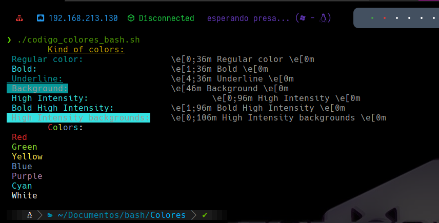
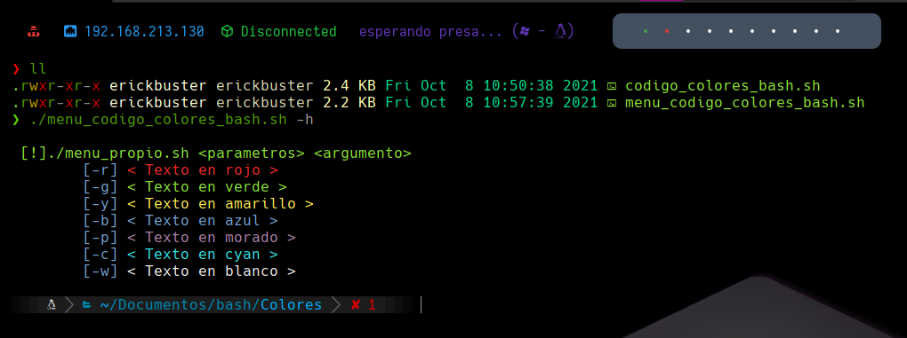
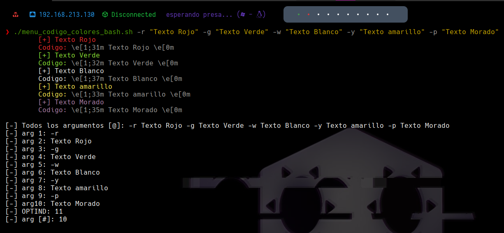

# Codigo de Colores para Bash
## codigo_colores_bash.sh
Es un script sencillo escrito en bash que muestra todos los codigos de colores para texto en bash como:
* Regular Colors
* Bold
* Underline
* Background
* High Intensity
* Bold High Intensity
* High Intensity Background

## menu_codigo_colores_bash.sh
Es un script sencillo escrito en bash. Contiene varios parametros que convierte el texto en el color deseado
y posteriormente muestra el codigo de color para ser usado en otro script en bash y el numero de argumentos que fueron ingresados, mostrando asi cada uno de ellos
El menu es el siguiente:

Un ejemplo del uso de la herramienta es el siguiente:

